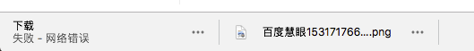
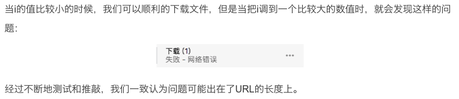

# canvas 下载大体积图片解决方法

## 遇到问题
在慧眼项目中，客户有下载高清热力图的需求，于是乎觉得这就是一个将canvas保存成图片的过程。要高清图片就保存成png格式就行了，比较容易实现，就动手了。代码如下
```javascript
var imageData = canvas.toDataURL("image/png").replace("image/png", "image/octet-stream");
save_link.href = imageData;
save_link.download = '百度慧眼' + (new Date()).getTime() + '.png';

var event = document.createEvent('MouseEvents');
event.initMouseEvent('click', true, false, window, 0, 0, 0, 0, 0, false, false, false, false, 0, null);
save_link.dispatchEvent(event);
```

然而千算万算没想到这段代码也能有问题，并且非常诡异。在下载体积较小的图片的时候，一切正常，但是图片稍微大一点，或者是mac下的2倍图片，浏览器就会报“网络错误”这个错误
  
这让人很费解，百度了一下也查不到这个问题所在的原因是什么，于是只能寻求解决办法。

<!--more-->

## 解决方案
### 方法一：jpeg格式+质量参数
首先仔细看一下`canvas.toDataURL`这个方法
`canvas.toDataURL(mimeType, qualityArgument)`  
`mimeType`表示`canvas`导出来的`base64`图片的类型，`canvas.toDataURL()`方法默认是png格式，也即是默认值是`'image/png'`，我们也可以指定为jpg格式`'image/jpeg'`或者webp等格式。
`qualityArgument`表示导出的图片质量，只要导出为`jpg`和`webp`格式的时候此参数才有效果，默认值是0.92，是一个比较合理的图片质量输出参数，通常情况下，我们无需再设定。

于是，我们将以上代码修改为保存成`jpg`格式，并将`quality`设置为`0.9`，代码如下
```javascript
var imageData = canvas.toDataURL("image/jpeg",0.9).replace("image/jpeg", "image/octet-stream");
save_link.href = imageData;
save_link.download = '百度慧眼' + (new Date()).getTime() + '.jpeg';

var event = document.createEvent('MouseEvents');
event.initMouseEvent('click', true, false, window, 0, 0, 0, 0, 0, false, false, false, false, 0, null);
save_link.dispatchEvent(event);
```
暂时解决了问题，但并没有一劳永逸，如果遇到更大的底图，更多的热力数据，可能还是会出现“网络错误的问题”，那我们要如何找到更加治本的方法呢？

### 方法二：canvas.toBlob()
前几天看见文龙发表了博客 [Web APP/JavaScript 下载大文件解决方案](https://zhuwenlong.com/blog/article/5b4886b70a06a868748e10b4) ，阅读完之后发现和我遇到的这个问题相似度99%！根据他的分析，导致文件过大之后无法下载的原因是因为URL的长度限制
  
根据他文章的介绍，我们遇到的问题可以通过`Blob`和`URL.createObjectURL()`双剑合壁来解决，以上这两者的介绍可以去看文龙的博客。我们要做的是，`canvas`到底怎么转化成`Blob`呢？下面我们了解一下。
`canvas.toBlob(callback, mimeType, qualityArgument)`
可以把`canvas`转换成`Blob`文件，通常用在文件上传中，是二进制的。
和`toDataURL()`方法相比，`toBlob()`方法是异步的，因此多了个`callback`参数，这个`callback`回调方法默认的第一个参数就是转换好的`blob`文件信息。
但是`canvas.toBlob()`方法有浏览器兼容限制，只能在`Chrome 50`，`webview 50`以上才可以使用。
了解了这些，我们再修改代码如下：
```javascript
if (canvas.toBlob) {
    // toBlob 方法是异步的
    canvas.toBlob(function(blob) {
        save_link.href = URL.createObjectURL(blob);
        save_link.download = '百度慧眼' + (new Date()).getTime() + '.png';

        var event = document.createEvent('MouseEvents');
        event.initMouseEvent('click', true, false, window, 0, 0, 0, 0, 0, false, false, false, false, 0, null);
        save_link.dispatchEvent(event);
    });
} else {
    // toDataUrl 方法是同步的
    var imageData = canvas.toDataURL("image/jpeg",0.9).replace("image/jpeg", "image/octet-stream");
    save_link.href = imageData;
    save_link.download = '百度慧眼' + (new Date()).getTime() + '.jpeg';

    var event = document.createEvent('MouseEvents');
    event.initMouseEvent('click', true, false, window, 0, 0, 0, 0, 0, false, false, false, false, 0, null);
    save_link.dispatchEvent(event);
}
```
解决问题了。

## 其他
其实文龙的那边博客本来是介绍的一个github上专门解决下载各种格式的大型文件的[FileSaver](https://github.com/eligrey/FileSaver.js/blob/master/src/FileSaver.js)库，我们也可以直接调用这个库来解决问题。

然后，这篇文章只是简单的记录一下这个问题的解决方案，同时也推荐阅读这篇文章后阅读一下文龙的博客 [Web APP/JavaScript 下载大文件解决方案](https://zhuwenlong.com/blog/article/5b4886b70a06a868748e10b4) ，有更深一步的了解。