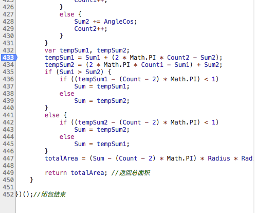
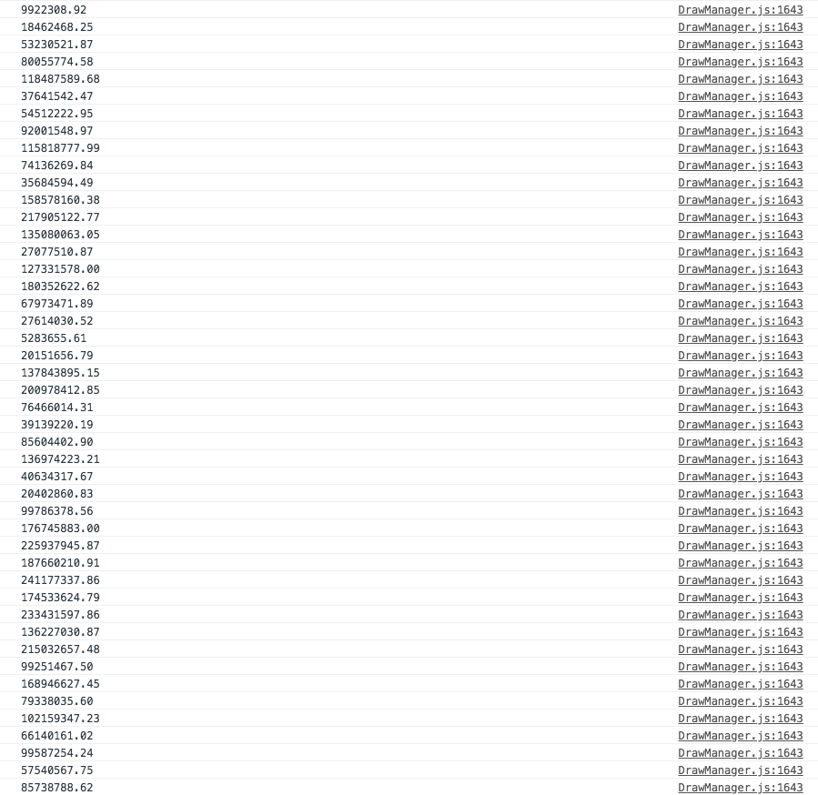

### 发现问题
由于在项目中需要前端计算地图区域多边形面积，所以用到了`BMapLib.GeoUtils.getPolygonArea()`方法。但是在计算项目中矩形面积的时候，居然有时会出现面积是0的情况，并且传入的点数据实际上并没有什么问题。
那么问题出现了！究竟是什么原因导致一个矩形的面积会返回为0呢？为了探清这一真相，我们必须深入这个[BMap几何运算库](http://api.map.baidu.com/library/GeoUtils/1.2/src/GeoUtils.js)里面找到答案。

<!--more-->

### 寻找原因

这是`BMapLib.GeoUtils.getPolygonArea()`这个函数里的一个`for`循环。。。服了，全是`sin` `cos`这些东西，大概是把专门的根据坐标计算几何面积的算法来翻译成编程语言的。深呼吸一口，来看看返回面积为0的原因！
首先在`for`循环结束的地方打一个断点，来看看导致`totalArea`为0的原因到底是`Sum` `Count` `Radius`哪个参数造成的。

果然找到了，`Sum`是一个`NaN`，并且同时也看见赋值给`Sum`的`tempSum1`和`tempSum2`都是`NaN`！而造成`tempSum1`和`tempSum2`异常的参数是这个`AngleCos`参数。

OK，在`for`循环里面找到`AngleCos`参数这里再打一个断点

找到了，果然是由于它造成的`NaN`问题


这两行`AngleCos`的计算代码如下
```javascript
AngleCos = (AHtangent * ALtangent + BHtangent * BLtangent + CHtangent * CLtangent) / (Math.sqrt(AHtangent * AHtangent + BHtangent * BHtangent + CHtangent * CHtangent) * Math.sqrt(ALtangent * ALtangent + BLtangent * BLtangent + CLtangent * CLtangent));

AngleCos = Math.acos(AngleCos);  
```

把`AHtangent` `ALtangent` `BHtangent`  `BLtangent` `CHtangent` ` CLtangent`这四个参数分别存参数为`temp1`~`temp6`，然后计算，发现是在`AngleCos = Math.acos(AngleCos); `这一步翻水了。。。

那么查一下这个`Math.acos()`方法吧，果然。。。问题就在这儿了。。。第一步运算结果为`-1.000000000000002`导致传入第二步运算的时候超过了`-1.0`的范围

### 解决问题
既然找到了问题，就想办法解决一下吧。
首先，问题定位这个`-1.0000000000000002`上面，程序员的直觉告诉我这个多出来的`-0.000...002`很有可能是在浮点数计算中产生的误差，有可能实际返回结果应该是`-1.0`而已。但这只是一个猜测，并不能这么草率的强行改过来，所以需要具体研究看一下这个`AngleCos`到底有什么用，预期结果究竟是不是`-1.0`。
研究这个参数在算法中有什么作用并没有什么帮助，反正我也不打算重新写一个算发出来（不是数学系大神）。。。所以可以判断一下是不是由于浮点数精度丢失导致的就可以了，判断方法就是：自己再手算一遍！

半个多小时过去了，说实话，手算简直在找虐。。。**但是，真相出来了，就是由于浮点数精度丢失导致的**。我甚至后来又用js算了一遍，发现最后的结果是`(-2.5232865177698275e-7)/(2.523286517769827e-7)`唉。。。

所以解决方案非常简单，源文件里加上一行代码
搞定！
再次运行获得多边形面积的函数，再也不会出现结果为`0`的错误了。


### 总结与发散
手算了半个多小时，最后只能感叹计算机的**计算**能力并不可靠。。。因为和C/JAVA等其他语言不一样，C和JAVA的`%f`是小数后六位，但是在JS中，预设是最精确的输出，比如十进制的`0.7`很简单，但是二进制是循环小数`0.10110011001100110...`所以JS连简单的浮点数加法都全是坑😤😤😤
说到这里，必须要皮一下


对了，上面说到最后导致出错的结果是`(-2.5232865177698275e-7)/(2.523286517769827e-7)`，前后两个数的绝对值只差了`5.0e-23`，我们将前后两个数相加，看看会不会得到`5.0e-23`这个数呢？

😵😵😵😵意料之中。。。卒。

